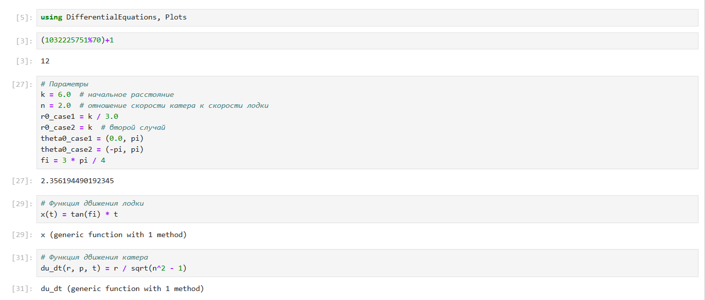
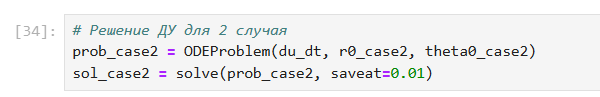
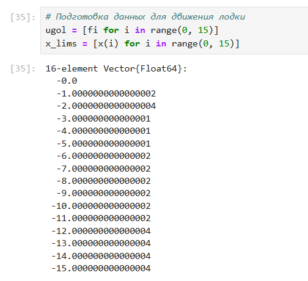
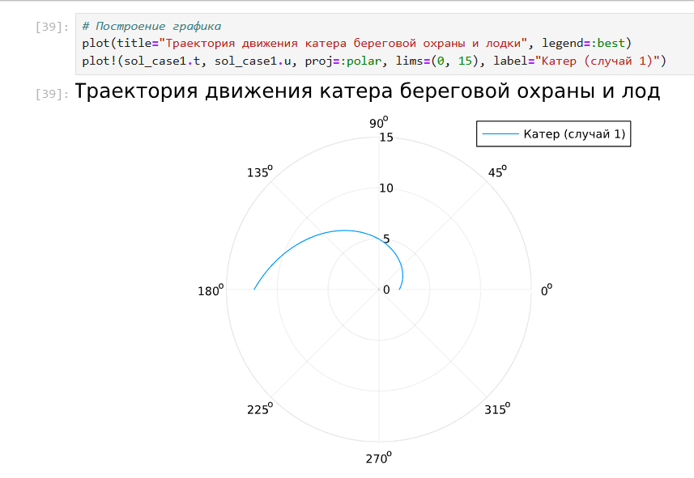
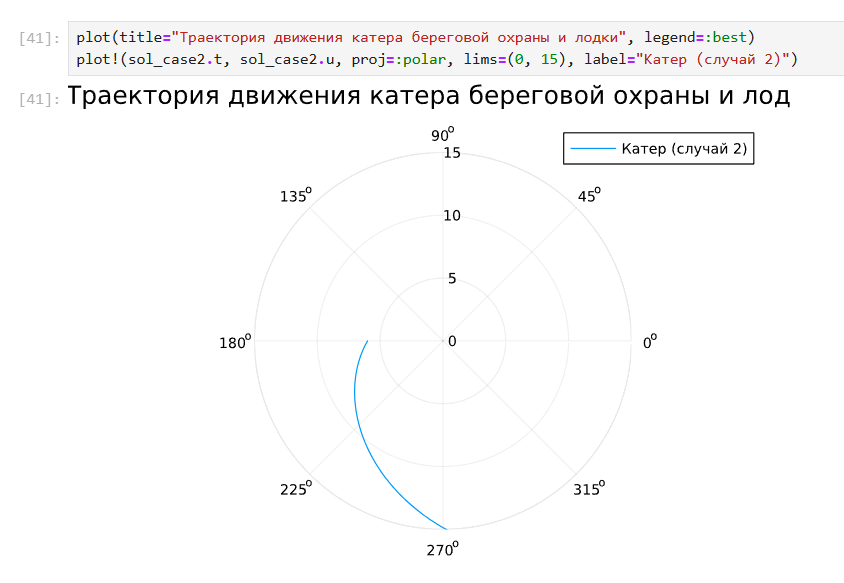
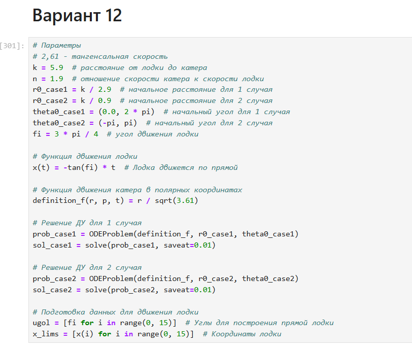
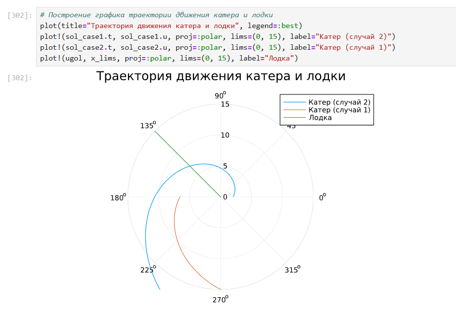
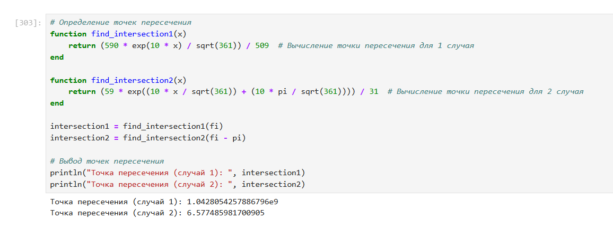

---
## Front matter
lang: ru-RU
title: Лабораторная работа № 2. Презентация
subtitle: Математическое моделирование
author:
  - Королев И.А.
institute:
  - Российский университет дружбы народов, Москва, Россия

## i18n babel
babel-lang: russian
babel-otherlangs: english

## Formatting pdf
toc: false
toc-title: Содержание
slide_level: 2
aspectratio: 169
section-titles: true
theme: metropolis
header-includes:
 - \metroset{progressbar=frametitle,sectionpage=progressbar,numbering=fraction}
---

# Информация

## Докладчик

:::::::::::::: {.columns align=center}
::: {.column width="70%"}

  * Королев Иван Андреевич
  * Студент
  * Российский университет дружбы народов

:::
::::::::::::::

# Цель работы

Задача о погоне. Рассмотрим задачу преследования браконьеров береговой охраной. Необходимо определить по какой траектории необходимо двигаться катеру, чтоб нагнать лодку.

# Задание

Написать решение задачи о погоне на языке программирования Julia.

# Теоретическое введение

Julia — высокоуровневый свободный язык программирования с динамической типизацией, созданный для математических вычислений. Эффективен также и для написания программ общего назначения. Синтаксис языка схож с синтаксисом других математических языков, однако имеет некоторые существенные отличия.

# Выполнение лабораторной работы

# Решение задача о погоне из примера лабораторной работы

{#fig:001 width=70%}

# Решение ДУ для 1-го случая

{#fig:002 width=70%}

# Решение ДУ для 2-го случая

{#fig:003 width=70%}

# Подготовка данных для движения лодки

{#fig:004 width=70%}

# Траектория движения катера для 1-го случая 

{#fig:005 width=70%}

# Траектория движения катера для 2-го случая

{#fig:006 width=70%}

# Решение 12 Варианта самостоятельного задания

{#fig:007 width=70%}

# Траектории движения катера и лодки, точки пересечения. 

{#fig:008 width=70%}

# Траектории движения катера и лодки, точки пересечения. 

{#fig:009 width=70%}

# Выводы

Рассмотрел задачу преследования браконьеров береговой охраной. Определил по какой траектории необходимо двигаться катеру, чтоб нагнать лодку.

# Список литературы{.unnumbered}

::: {#refs}
:::
