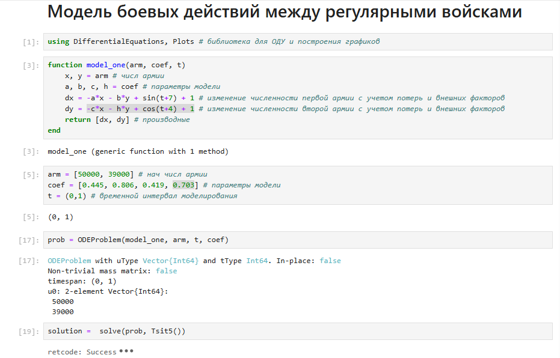
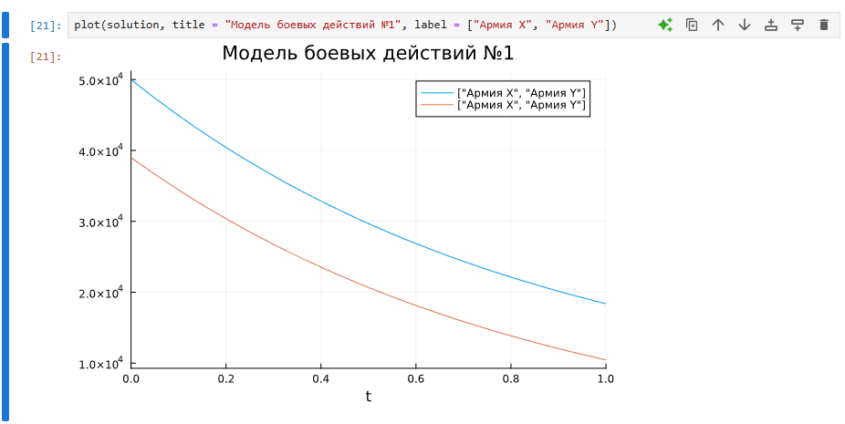
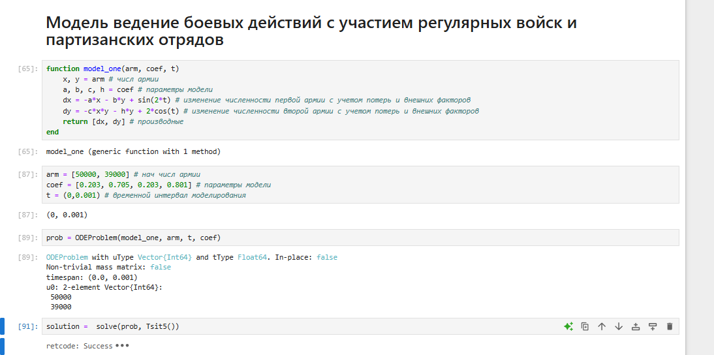
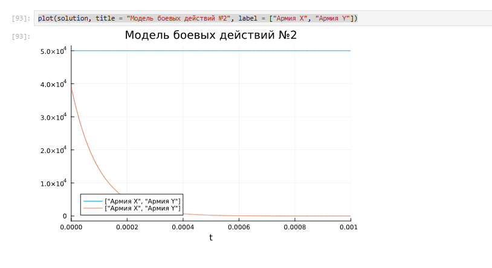
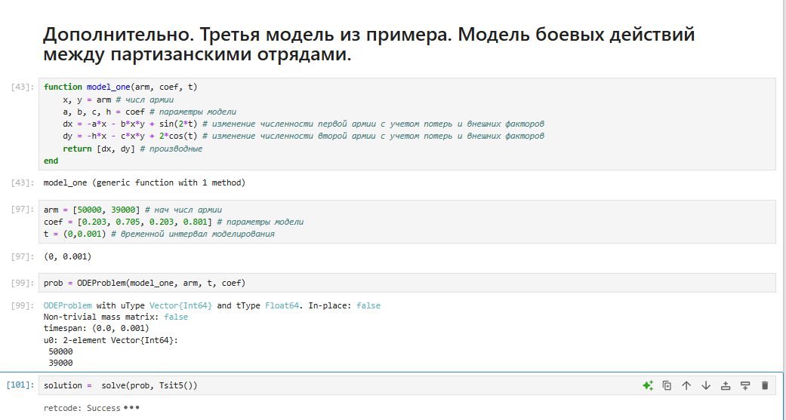
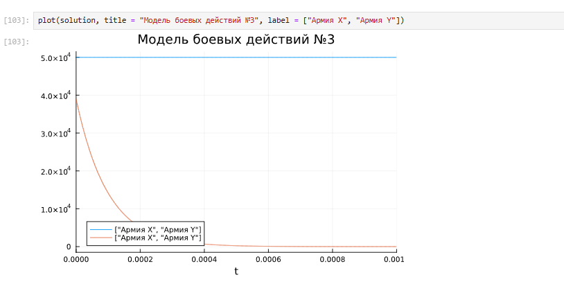
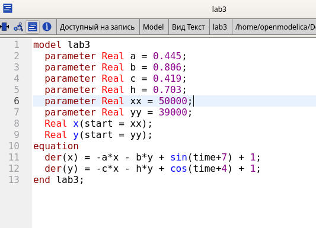
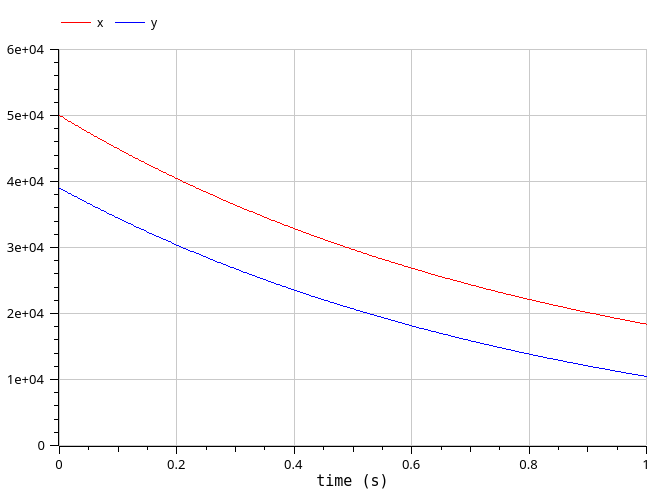
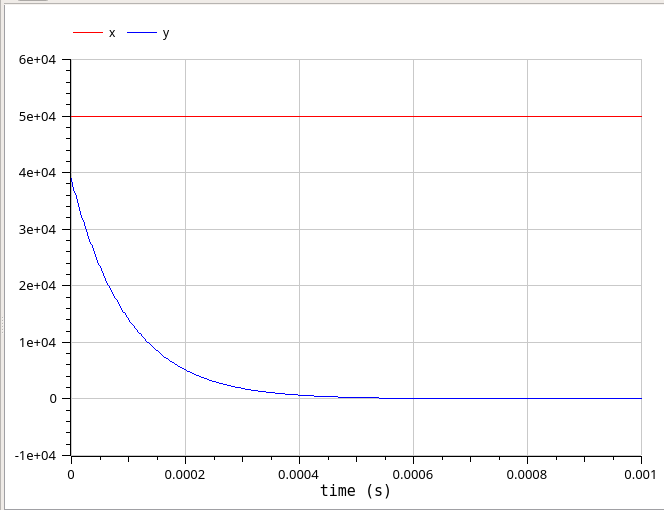

---
## Front matter
lang: ru-RU
title: Лабораторная работа № 3
subtitle: Математическое моделирование
author:
  - Королёв И.А.
institute:
  - Российский университет дружбы народов, Москва, Россия

## i18n babel
babel-lang: russian
babel-otherlangs: english

## Formatting pdf
toc: false
toc-title: Содержание
slide_level: 2
aspectratio: 169
section-titles: true
theme: metropolis
header-includes:
 - \metroset{progressbar=frametitle,sectionpage=progressbar,numbering=fraction}
---

# Цель работы

Рассмотреть простейшие модели боевых действий и смоделировать их на языках программирования Julia и Modelica.

# Задание

Необходимо было рассмотреть 3 модели боя.

1. Модель боевых действий между регулярными войсками

2. Модель ведение боевых действий с участием регулярных войск и партизанских отрядов

3. Модель боевых действий между партизанскими отрядами

# Задание

1. Модель боевых действий между регулярными войсками

$$\begin{cases}
    \dfrac{dx}{dt} = -0.445x(t)- 0.806y(t)+sin(t+7) + 1\\
    \dfrac{dy}{dt} = -0.419x(t)- 0.703y(t)+cos(t+4) + 1
\end{cases}$$

# Задание

2. Модель ведение боевых действий с участием регулярных войск и партизанских отрядов 

$$\begin{cases}
    \dfrac{dx}{dt} = -0.203x(t)-0.705y(t)+sin(2t)\\
    \dfrac{dy}{dt} = -0.203x(t)y(t)-0.801y(t)+2cos(t)
\end{cases}$$

# Теоретическое введение

Рассмотрим некоторые простейшие модели боевых действий – модели Ланчестера. В противоборстве могут принимать участие как регулярные войска, так и партизанские отряды. В общем случае главной характеристикой соперников являются численности сторон. Если в какой-то момент времени одна из численностей обращается в нуль, то данная сторона считается проигравшей (при условии, что численность другой стороны в данный момент положительна).
Рассмотри три случая ведения боевых действий:
1. Боевые действия между регулярными войсками
2. Боевые действия с участием регулярных войск и партизанских
отрядов
3. Боевые действия между партизанскими отрядами
В первом случае численность регулярных войск определяется тремя факторами:
* скорость уменьшения численности войск из-за причин, не связанных с боевыми действиями (болезни, травмы, дезертирство);
* скорость потерь, обусловленных боевыми действиями противоборствующих сторон (что связанно с качеством стратегии, уровнем вооружения, профессионализмом солдат и т.п.);
* скорость поступления подкрепления (задаётся некоторой функцией от времени).

# Выполнение лабораторной работы

## Построение моделей на языке программирования Julia

Моделирование боевых действий между регулярными войсками. Подключение библиотек для ОДУ и построения графиков. Функция для построения модели, начальные параметры модели (численность армий, коэффициенты модели, временной интервал моделирования). Решение системы ОДУ и задачи численным методом. 

{#fig:001 width=55%}

## Построение моделей на языке программирования Julia

Вывод результата модели боевых действий между регулярными войсками.

{#fig:002 width=55%}

## Построение моделей на языке программирования Julia

Моделирование ведения боевых действий с участием регулярных войск и партизанских отрядов. 

{#fig:003 width=55%}

## Построение моделей на языке программирования Julia

{#fig:004 width=55%}

## Построение моделей на языке программирования Julia

Дополнительно, этого пункта нет в самостоятельном задании, но я его тоже смоделировал для полноценного изучения всех вариаций моделей.

{#fig:005 width=55%}

## Построение моделей на языке программирования Julia

{#fig:006 width=55%}

## Построение моделей на языке программирования Modelica

Моделирование боевых действий между регулярными войсками. Реализация почти аналогична с Julia, только небольшая особенность задания переменных и решения. 

{#fig:007 width=55%}

## Построение моделей на языке программирования Modelica

Вывод результата модели боевых действий между регулярными войсками.

{#fig:008 width=55%}

## Построение моделей на языке программирования Modelica

Моделирование ведения боевых действий с участием регулярных войск и партизанских отрядов. 

{#fig:009 width=55%}

## Построение моделей на языке программирования Modelica

Вывод результата ведения боевых действий с участием регулярных войск и партизанских отрядов. Для более наглядного вывода, я сократил временной интервал. 

{#fig:0010 width=55%}

## Построение моделей на языке программирования Modelica

Сравнивая графики, полученные в Julia и OpenModelica, разницы особой незаметно. Если сильно вглядываться, можно заметить, что в OpenModelica график чуть более плавный и точный.

# Выводы

Рассмотрели простейшие модели боевых действий и смоделировать их на языках программирования Julia и Modelica.

# Список литературы{.unnumbered}

::: {#refs}
:::
