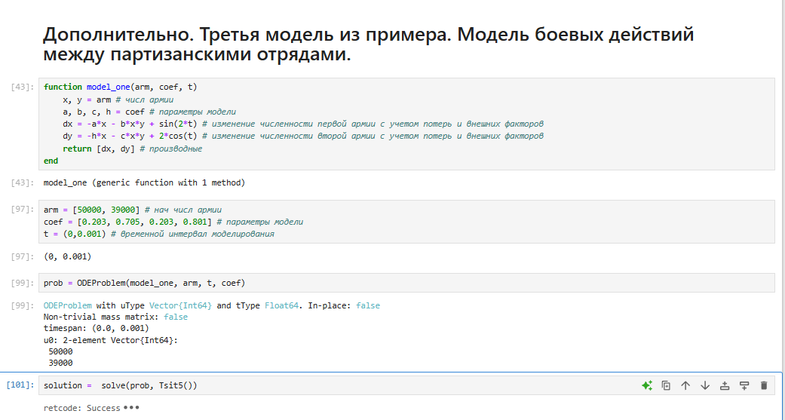
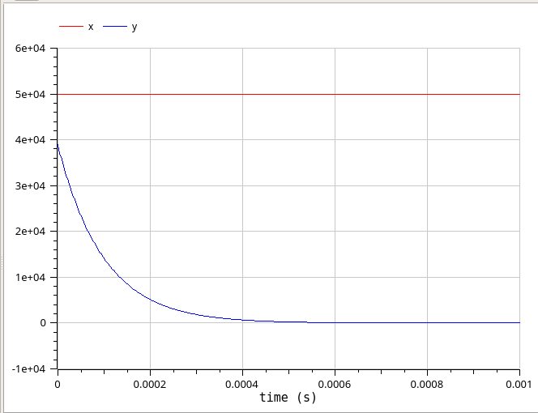

---
## Front matter
title: "Лабораторная работа № 3"
subtitle: "Математическое моделирование"
author: "Королёв Иван Андреевич"

## Generic otions
lang: ru-RU
toc-title: "Содержание"

## Bibliography
bibliography: bib/cite.bib
csl: pandoc/csl/gost-r-7-0-5-2008-numeric.csl

## Pdf output format
toc: true # Table of contents
toc-depth: 2
lof: true # List of figures
lot: true # List of tables
fontsize: 12pt
linestretch: 1.5
papersize: a4
documentclass: scrreprt
## I18n polyglossia
polyglossia-lang:
  name: russian
  options:
	- spelling=modern
	- babelshorthands=true
polyglossia-otherlangs:
  name: english
## I18n babel
babel-lang: russian
babel-otherlangs: english
## Fonts
mainfont: IBM Plex Serif
romanfont: IBM Plex Serif
sansfont: IBM Plex Sans
monofont: IBM Plex Mono
mathfont: STIX Two Math
mainfontoptions: Ligatures=Common,Ligatures=TeX,Scale=0.94
romanfontoptions: Ligatures=Common,Ligatures=TeX,Scale=0.94
sansfontoptions: Ligatures=Common,Ligatures=TeX,Scale=MatchLowercase,Scale=0.94
monofontoptions: Scale=MatchLowercase,Scale=0.94,FakeStretch=0.9
mathfontoptions:
## Biblatex
biblatex: true
biblio-style: "gost-numeric"
biblatexoptions:
  - parentracker=true
  - backend=biber
  - hyperref=auto
  - language=auto
  - autolang=other*
  - citestyle=gost-numeric
## Pandoc-crossref LaTeX customization
figureTitle: "Рис."
tableTitle: "Таблица"
listingTitle: "Листинг"
lofTitle: "Список иллюстраций"
lotTitle: "Список таблиц"
lolTitle: "Листинги"
## Misc options
indent: true
header-includes:
  - \usepackage{indentfirst}
  - \usepackage{float} # keep figures where there are in the text
  - \floatplacement{figure}{H} # keep figures where there are in the text
---

# Цель работы

Рассмотреть простейшие модели боевых действий и смоделировать их на языках программирования Julia и Modelica.

# Задание

Необходимо было рассмотреть 3 модели боя.

1. Модель боевых действий между регулярными войсками

2. Модель ведение боевых действий с участием регулярных войск и партизанских отрядов

3. Модель боевых действий между партизанскими отрядами

Выполнить самостоятельное задание. Вариант 13.

Между страной Х и страной У идет война. Численность состава войск исчисляется от начала войны, и являются временными функциями x(t) и y(t). В начальный момент времени страна Х имеет армию численностью 40 000 человек, а в распоряжении страны У армия численностью в 69 000 человек. Для упрощения модели считаем, что коэффициенты a,b, c, h постоянны. Также считаем P(t) и Q(t) непрерывные функции.
Постройте графики изменения численности войск армии Х и армии У для следующих случаев:

1. Модель боевых действий между регулярными войсками

$$\begin{cases}
    \dfrac{dx}{dt} = -0.445x(t)- 0.806y(t)+sin(t+7) + 1\\
    \dfrac{dy}{dt} = -0.419x(t)- 0.703y(t)+cos(t+4) + 1
\end{cases}$$

2. Модель ведение боевых действий с участием регулярных войск и партизанских отрядов 

$$\begin{cases}
    \dfrac{dx}{dt} = -0.203x(t)-0.705y(t)+sin(2t)\\
    \dfrac{dy}{dt} = -0.203x(t)y(t)-0.801y(t)+2cos(t)
\end{cases}$$

# Теоретическое введение

Рассмотрим некоторые простейшие модели боевых действий – модели Ланчестера. В противоборстве могут принимать участие как регулярные войска, так и партизанские отряды. В общем случае главной характеристикой соперников являются численности сторон. Если в какой-то момент времени одна из численностей обращается в нуль, то данная сторона считается проигравшей (при условии, что численность другой стороны в данный момент положительна).
Рассмотри три случая ведения боевых действий:
1. Боевые действия между регулярными войсками
2. Боевые действия с участием регулярных войск и партизанских
отрядов
3. Боевые действия между партизанскими отрядами
В первом случае численность регулярных войск определяется тремя факторами:
* скорость уменьшения численности войск из-за причин, не связанных с боевыми действиями (болезни, травмы, дезертирство);
* скорость потерь, обусловленных боевыми действиями противоборствующих сторон (что связанно с качеством стратегии, уровнем вооружения, профессионализмом солдат и т.п.);
* скорость поступления подкрепления (задаётся некоторой функцией от времени).

# Выполнение лабораторной работы

## Построение моделей на языке программирования Julia

Моделирование боевых действий между регулярными войсками. Подключение библиотек для ОДУ и построения графиков. Функция для построения модели, начальные параметры модели (численность армий, коэффициенты модели, временной интервал моделирования). Решение системы ОДУ и задачи численным методом. (рис. [-@fig:001]).

{#fig:001 width=70%}

Вывод результата модели боевых действий между регулярными войсками. Из графика видно, что выиграла армия страны  X, поскольку численность армии страны Y стала 0, а потом и вообще ушла в отрицательную часть графика. (рис. [-@fig:002]).

{#fig:002 width=70%}

Моделирование ведения боевых действий с участием регулярных войск и партизанских отрядов. Реализация полностью идентична с предыдущей моделью, отличается лишь тем небольших отличием модели и коэффициентами. (рис. [-@fig:003]).

{#fig:003 width=70%}

Вывод результата ведения боевых действий с участием регулярных войск и партизанских отрядов. Для более наглядного вывода, я сократил временной интервал. Здесь опять же выигрывает армия X, причем численность армии Y уменьшается до нуля практически моментально. Заметим также, что  даже после того как армия X победила (то есть численность армии Y стала равна 0), ее численность продолжает уменьшаться на заданном интервале (поскольку у нас есть коэффиценты, характеризующие степень влияния различных факторов на потери). На данном графике сложно отследить, как происходило уменьшение численности армии Y, поэтому давайте возьмем временной интервал поменьше, чтобы было более наглядно, как умирает армия Y (рис. [-@fig:004]): (рис. [-@fig:004]).

{#fig:004 width=70%}

Дополнительно, этого пункта нет в самостоятельном задании, но я его тоже смоделировал для полноценного изучения всех вариаций моделей. Модель боевых действия между партизанскими отрядами. (рис. [-@fig:005]).

{#fig:005 width=70%}

Вывод результата ведения боевых действий с участием регулярных войск и партизанских отрядов. (рис. [-@fig:006]).

{#fig:006 width=70%}

## Построение моделей на языке программирования Modelica

Моделирование боевых действий между регулярными войсками. Реализация почти аналогична с Julia, только небольшая особенность задания переменных и решения. (рис. [-@fig:007]).

{#fig:007 width=70%}

Вывод результата модели боевых действий между регулярными войсками.  (рис. [-@fig:008]).

{#fig:008 width=70%}

Моделирование ведения боевых действий с участием регулярных войск и партизанских отрядов. Реализация полностью идентична с предыдущей моделью, отличается лишь тем небольших отличием модели и коэффициентами. (рис. [-@fig:009]).

{#fig:009 width=70%}

Вывод результата ведения боевых действий с участием регулярных войск и партизанских отрядов. Для более наглядного вывода, я сократил временной интервал. (рис. [-@fig:0010]).

{#fig:0010 width=70%}

Сравнивая графики, полученные в Julia и OpenModelica, разницы особой незаметно. Если сильно вглядываться, можно заметить, что в OpenModelica график чуть более плавный и точный.

# Выводы

Рассмотрели простейшие модели боевых действий и смоделировать их на языках программирования Julia и Modelica.

# Список литературы{.unnumbered}

::: {#refs}
:::
