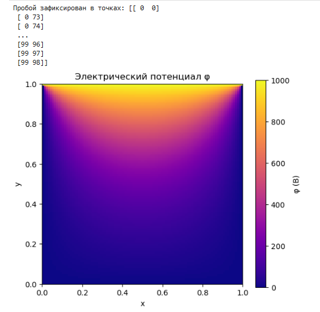

---
## Front matter
lang: ru-RU
title: Этап 3. Комплексы программ. Описание программной реализации проекта.
subtitle: Математическое моделирование
author:
  - Королёв И.А. Шуплецов Александр Кудряшов Артем Давит Оганнисян Мугари Абдурахим
institute:
  - Российский университет дружбы народов, Москва, Россия

## i18n babel
babel-lang: russian
babel-otherlangs: english

## Formatting pdf
toc: false
toc-title: Содержание
slide_level: 2
aspectratio: 169
section-titles: true
theme: metropolis
header-includes:
 - \metroset{progressbar=frametitle,sectionpage=progressbar,numbering=fraction}
---

# Информация

## Докладчик

:::::::::::::: {.columns align=center}
::: {.column width="70%"}

  * Королёв Иван Андреевич
  * Студент
  * Российский университет дружбы народов

:::
::::::::::::::

# Назначение этапа

Цель данного этапа - реализация численного алгоритма моделирования электрического пробоя в виде рабочего программного комплекса. Программа разрабатывается на языке Python с использованием научных библиотек и включает в себя все ключевые модули: от инициализации до визуализации

# Язык и инструменты

* Язык программирования Python
* Основные библиотеки:
* NumPy - для работы с массивами и векторными вычислениями 
* Matplotlib - для визуализации распределения потенциала и полей

# Модуль инициализации 

* Заданы размеры расчетной области: 1.0 м х 1.0 м.
* Сетка дискретизации: 100×100 узлов, шаги dx и dy.
* Определены параметры среды:
* диэлектрическая проницаемость ε (однородная);
* плотность заряда ρ (нулевая на старте);
* электрическая проводимость σ (низкое значение).
* Установлены граничные условия:
    1. нижняя граница потенциала = 0 В;
    2. верхняя граница потенциала = 1000 В.
    
# Модуль инициализации 

```
# Параметры среды и расчётной области
Lx, Ly = 1.0, 1.0
Nx, Ny = 100, 100
dx, dy = Lx / Nx, Ly / Ny
x = np.linspace(0, Lx, Nx)
y = np.linspace(0, Ly, Ny)
```

# Модуль инициализации 

```
epsilon = np.ones((Nx, Ny)) * 8.85e-12
rho = np.zeros((Nx, Ny))
sigma = np.ones((Nx, Ny)) * 1e-10
```

# Модуль инициализации 

```
phi = np.zeros((Nx, Ny))
E_x = np.zeros((Nx, Ny))
E_y = np.zeros((Nx, Ny))
tol = 1e-4
```

# Модуль инициализации 

```
phi[:, 0] = 0        # нижняя граница
phi[:, -1] = 1000    # верхняя граница
```

# Модуль решения уравнения Пуассона 

# 1. Метод конечных разностей для дискретизации

Метод конечных разностей — это способ замены производных в дифференциальных уравнениях на разностные выражения. Он позволяет перейти от непрерывного уравнения Пуассона:

$$
\nabla^2 \varphi = -\frac{\rho}{\varepsilon}
$$

к дискретной форме, пригодной для программной реализации. На равномерной сетке шагами $\Delta x$ и $\Delta y$, лапласиан аппроксимируется следующим образом (в двумерном случае):

$$
\frac{\varphi_{i+1,j} + \varphi_{i-1,j} + \varphi_{i,j+1} + \varphi_{i,j-1} - 4\varphi_{i,j}}{\Delta x^2} = -\frac{\rho_{i,j}}{\varepsilon_{i,j}}
$$

# 1. Метод конечных разностей для дискретизации

Отсюда выражается новая итерационная формула для $\varphi_{i,j}$:

$$
\varphi_{i,j}^{(k+1)} = \frac{1}{4} \left( \varphi_{i+1,j}^{(k)} + \varphi_{i-1,j}^{(k)} + \varphi_{i,j+1}^{(k)} + \varphi_{i,j-1}^{(k)} + \frac{\Delta x^2 \cdot \rho_{i,j}}{\varepsilon_{i,j}} \right)
$$

# 2. Метод Якоби (простых итераций)

Метод Якоби — это итерационная схема, в которой новое значение потенциала $\varphi_{i,j}^{(k+1)}$ рассчитывается исключительно на основе значений предыдущего шага $\varphi^{(k)}$. Все новые значения рассчитываются одновременно, независимо друг от друга, используя значения с предыдущей итерации.

# 2. Метод Якоби (простых итераций)

Преимущества:

* Простота реализации.
* Хорошо подходит для параллелизации.

# 2. Метод Якоби (простых итераций)

Недостатки:

* Медленная сходимость.
* Требует большого числа итераций по сравнению с другими методами (например, Гаусса–Зейделя).

# 3. Критерий завершения итераций

Чтобы остановить итерационный процесс, проверяется условие сходимости: если изменения потенциала между двумя последовательными шагами малы во всей расчетной области, то решение считается достигнутым.

Конкретно, в коде используется норма максимального изменения потенциала:

```python
if np.max(np.abs(phi - phi_old)) < tol:
    break
```

где:

* `phi_old` — массив потенциала с предыдущей итерации;
* `phi` — массив текущих значений;
* `tol = 1e-4` — заданный порог точности.

# 3. Критерий завершения итераций

Это означает, что итерации будут выполняться до тех пор, пока максимум абсолютных изменений между итерациями не станет меньше 0.0001 В.

# 3. Критерий завершения итераций

```
def solve_poisson(phi, rho, epsilon):
    for _ in range(5000):
        phi_old = phi.copy()
        phi[1:-1, 1:-1] = 0.25 * (
            phi[:-2, 1:-1] + phi[2:, 1:-1] +
            phi[1:-1, :-2] + phi[1:-1, 2:] +
            dx**2 * rho[1:-1, 1:-1] / epsilon[1:-1, 1:-1]
        )
        if np.max(np.abs(phi - phi_old)) < tol:
            break
    return phi
```

# Модуль расчета электрического поля

* Компоненты электрического поля E_x и E_y рассчитываются как градиент потенциала:
* с использованием центральной разности (через функцию np.roll).
* Обновление поля происходит после каждого перерасчета потенциала.

# Модуль расчета электрического поля

Программный код: 

```
def compute_electric_field(phi):
    E_x = -(np.roll(phi, -1, axis=0) - np.roll(phi, 1, axis=0)) / (2 * dx)
    E_y = -(np.roll(phi, -1, axis=1) - np.roll(phi, 1, axis=1)) / (2 * dy)
    return E_x, E_y
```

# Модуль уравнения непрерывности

* Ток рассчитывается по закону Ома: j = σE.
* Дивергенция тока используется для обновления плотности заряда по уравнению непрерывности:
* ∂ρ/∂t = -∇·j.
* Плотность заряда обновляется на каждом временном шаге.

# Модуль уравнения непрерывности

Программный код: 

```
def update_rho(rho, E_x, E_y, sigma):
    j_x = sigma * E_x
    j_y = sigma * E_y
    div_j = (np.roll(j_x, -1, axis=0) - np.roll(j_x, 1, axis=0)) / (2 * dx) + \
            (np.roll(j_y, -1, axis=1) - np.roll(j_y, 1, axis=1)) / (2 * dy)
    rho += -div_j * 1e-9  # dt (в секундах)
    return rho
```

# Модуль проверки пробоя

* Проверяется величина электрического поля в каждой точке.
* Если модуль поля превышает заданный порог (3 МВ/м), пробой считается зафиксированным.
* Координаты точки пробоя выводятся в консоль.

# Модуль проверки пробоя

Программный код: 

```
def check_breakdown(E_x, E_y, threshold=3e6):
    E_mag = np.sqrt(E_x**2 + E_y**2)
    mask = E_mag >= threshold
    if np.any(mask):
        indices = np.argwhere(mask)
        print("Пробой зафиксирован в точках:", indices)
        return True
    return False
    
```
    
# Основной цикл моделирования

```
for step in range(100):
    phi = solve_poisson(phi, rho, epsilon)
    E_x, E_y = compute_electric_field(phi)
    rho = update_rho(rho, E_x, E_y, sigma)
    if check_breakdown(E_x, E_y):
        break
```

# Модуль визуализации

* Используется библиотека Matplotlib.
* Строится тепловая карта распределения электрического потенциала φ.
* Возможность сохранения и расширения для отображения E, ρ, стримеров и других данных.
Программный код: 

```
# Визуализация
plt.figure(figsize=(6, 5))
plt.title("Электрический потенциал φ")
plt.imshow(phi.T, origin='lower', extent=[0, Lx, 0, Ly], cmap='plasma')
plt.colorbar(label='φ (В)')
plt.xlabel('x')
plt.ylabel('y')
plt.show()
```

# Результат

Этот график представляет распределение электрического потенциала $\varphi$ в двумерной расчетной области. Изображение наглядно показывает:

* **Градиент потенциала**: потенциал возрастает снизу вверх — от $\varphi = 0\ \text{В}$ (нижняя граница) до $\varphi = 1000\ \text{В}$ (верхняя граница).
* **Плавное изменение цвета** указывает на равномерное распределение электрического поля в области.
* **Цветовая шкала справа** обозначает значение потенциала в вольтах.

# Результат

{#fig:001 width=70%}

# Выводы

Созданный программный комплекс реализует ключевые этапы моделирования электрического пробоя. Он обеспечивает гибкость, визуализацию и масштабируемость и может быть использован как учебный, исследовательский и инженерный инструмент.

# Список литературы{.unnumbered}

::: {#refs}
:::

